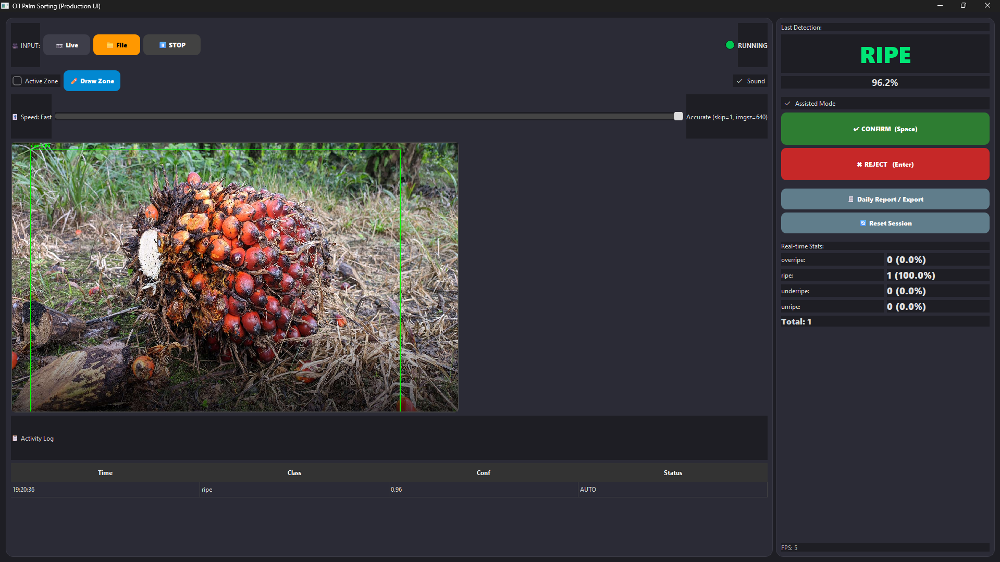
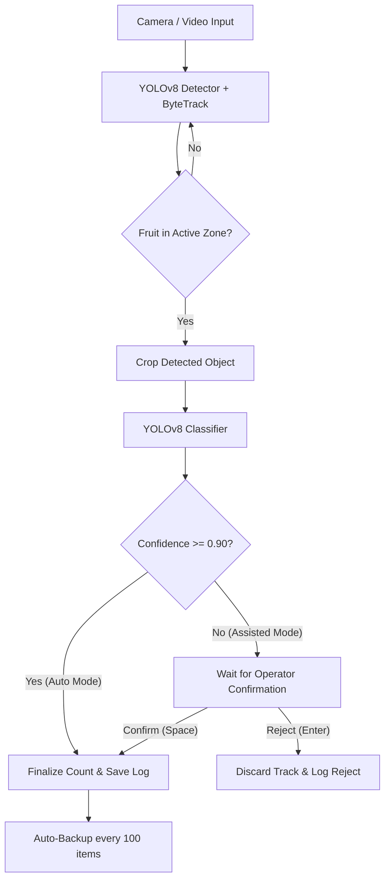

# Oil Palm Sorting System (Production UI)

An AI-driven desktop application built with Python, PySide6, and Ultralytics YOLOv8 to automate and assist in the quality control of oil palm fruits.

---

## 🖥️ Application Interface


*(Note: The screenshot demonstrates the application interface during a test run using an imported sample image, not a live camera feed.)*

---

## ⚙️ System Architecture

The following diagram illustrates the application workflow, from camera acquisition to final counting, logging, and operator confirmation:



---

## ✨ Key Features
* **Dual-Model Inference:** Uses `detector.pt` for object detection/tracking (ByteTrack) and `classify.pt` for classification (Unripe, Ripe, Overripe).
* **Smart Tracking & Stabilization:** Integrated ByteTrack with confidence stabilization frames to ensure highly accurate, double-count-free tracking.
* **Auto & Assisted Modes:** Automates sorting for high-confidence items while allowing manual operator override (Space to confirm, Enter to reject) for ambiguous classifications.
* **Production-Ready Tools:**
  * **Real-time Statistics:** Instant throughput counter and classification percentage breakdown on-screen.
  * **Automatic Backup:** Saves and backups session states every 100 items to JSON and CSV.
  * **Persistent Settings:** Automatically saves and restores the user-drawn Active Zone parameters across sessions.
  * **Daily Export:** Generates daily reports and summary exports (TXT and CSV) at the click of a button.

---

## 📂 Project Structure

The project has been refactored into a clean, modular structure:

```
oil-palm-sort/
├── main.py                  # Application entry point (initializes logging and starts Qt loop)
├── config.py                # System settings, paths, thresholds, and folder creation
├── styles.py                # QSS stylesheet for the premium dark mode UI
├── camera.py                # OpenCV-based camera capture and automatic reconnection helper
├── requirements.txt         # Project dependencies
├── screenshot.png           # UI Screenshot file
├── widgets/
│   ├── __init__.py
│   └── drawable_label.py    # Custom QLabel allowing mouse dragging to draw active zone
├── ui/
│   ├── __init__.py
│   └── main_window.py       # Main Application layout and PySide6 UI controller
├── logic/
│   ├── __init__.py
│   ├── tracker.py           # Fruit track lifecycle management
│   └── reporter.py          # CSV logging, statistics backups, and report exports
└── logs/                    # System logs directory (created automatically)
    ├── app.log              # Persistent operation logs
    └── zone.json            # Automatically persisted active zone configuration
```

---

## 🚀 Installation & Running

### 1. Requirements
Ensure you have Python 3.10+ installed.

Install the required packages using the terminal:
```bash
pip install -r requirements.txt
```

### 2. Run the Application
Start the application by running the main entry point:
```bash
python main.py
```

---

## 📦 Packaging to Standalone Executable (.exe)

You can package the application into a standalone Windows executable using PyInstaller.

### 1. Install PyInstaller
```bash
pip install pyinstaller
```

### 2. Build Commands

#### Option A: Embedded Model Files (Recommended for Single-File Distribution)
To bundle the YOLO model weights directly inside the `.exe` file:
```bash
pyinstaller --clean -y --noconsole --name="OilPalmSorter" --collect-all ultralytics --add-data "detector.pt;." --add-data "classify.pt;." main.py
```

#### Option B: External Model Files (Recommended for easy model updates)
To keep the `.pt` models outside the `.exe` so you can swap or update them later without rebuilding the application:
```bash
pyinstaller --clean -y --noconsole --name="OilPalmSorter" --collect-all ultralytics main.py
```
*Note: After building with Option B, copy `detector.pt` and `classify.pt` into the same directory as the generated `OilPalmSorter.exe` (inside the `dist/OilPalmSorter` directory).*
